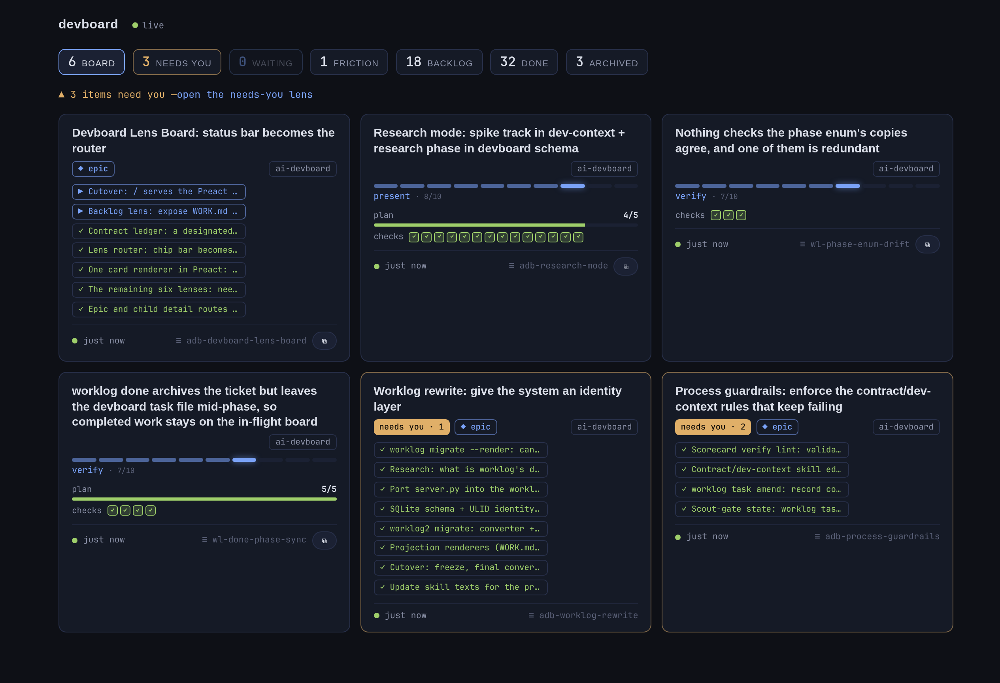

# Devboard

A browser dashboard over a directory of task files, so the human
can follow agent work without living in terminal scrollback. Agents (or
anyone) drop one YAML/JSON file per task into `<data-root>/<repo>/`; the
page renders plan todos, the contract scorecard, decisions, code-to-know,
a "needs you" attention queue, tier/complexity/worklog badges, and a
copy-`claude --resume` button per task (from the `session` field) — and
hot-reloads within ~2s of any file change, no refresh needed (SSE,
auto-reconnecting).

Tasks with a `worklog:` join key also render the ticket's
`notes/<id>.md` live from the worklog data dir (second read-only mount) —
rendered, never copied, and note edits hot-reload too. That mount also
carries `FEEDBACK.md`, rendered as the global Friction panel (see below).



The intended writer is the `worklog` CLI (`start`/`done`/`pr` side
effects plus the `worklog task` family, including `untrack` to stop
tracking a task by deleting only its YAML) — but a hand-dropped
schema-valid file is fully supported.

## Run

The server lives in the `worklog` binary — frontend embedded, no runtime
dependencies. The vendored Preact and HTM modules the newer front-end loads
are committed and embedded alongside the pages, so npm is never needed to
build, release, or run this:

```sh
worklog serve
# open http://localhost:8484
```

For supervision (start on boot, restart on crash), `worklog install`
offers a systemd user unit running exactly that; accept it, or manage it
directly:

```sh
systemctl --user status devboard   # the unit installed by `worklog install`
```

Defaults: data dir `~/.local/share/devboard`, port `8484`, worklog dir
`~/.local/share/worklog` (for notes rendering). Override with the
environment: `DEVBOARD_DATA`, `DEVBOARD_WORKLOG`, `DEVBOARD_PORT`,
`DEVBOARD_SCAN_INTERVAL`. The server reads the worklog dir and never
writes under it; the data dir is written for exactly one operation:
archiving (see below). The response shape is frozen as the frontend
contract — see [API.md](API.md).

Fallback: a Docker deployment (multi-stage build of the same binary) for
setups that prefer container supervision:

```sh
docker compose -f devboard/compose.yaml up --build -d   # from the repo root
```

## Directory layout

```
<data-root>/
  <repo-name>/          # grouping = directory name
    <task-slug>.yaml    # one file per task (.yml/.json also fine)
    _archive/           # archived tasks (moved here by the UI; kept on disk)
      <task-slug>.yaml
```

See [schema.md](schema.md) for the task file format (`schema: 1`), and
[examples/](examples/) for ready-made files — try it out with:

```sh
cp -r examples/* ~/.local/share/devboard/
```

## Archive / un-archive

The board's only write action. The archive button (on done cards and in
every task's detail view) moves the task's file into `<repo>/_archive/`;
archived tasks leave the grid, stats, and attention band and collapse into
an "Archived · N" fold with un-archive buttons that move them back. Nothing
is ever deleted or rewritten — both endpoints (`POST /api/archive`,
`POST /api/unarchive`, JSON body `{"repo", "id"}`) are a single validated
rename, and the worklog dir is never touched. There is no auth: anyone who
can reach the port can archive/un-archive (reversible by design; the server
rejects non-JSON content types and never answers CORS preflights, so a
browsing session on another site can't trigger it cross-origin).

## Friction panel

`FEEDBACK.md` at the root of the worklog mount is the friction log the
worklog skill's capture subagent appends to (`worklog feedback append`).
The board renders it as a single global band — it is not per-task, so no
task-file field is involved:

- an unreviewed count in the topbar stats, absent when nothing is outstanding
- a collapsed `Friction · N` fold with a count per signal, then the
  unresolved entries newest-first (signal, local time, trigger, and a fold
  for the excerpt and context)
- resolved entries in a `Resolved · N` sub-fold, dimmed

Reviewing happens in the CLI, never here: the worklog mount is read-only, so
each entry offers a button that copies `worklog feedback resolve <timestamp>`
rather than writing anything. Running it adds a `**Resolved**: <unix-ts>`
line to that entry, and the board updates over SSE within ~2s.

The entry format is owned by `worklog/internal/feedback/feedback.go`, and
the server reads it through that same package — one parser, so board and
CLI cannot drift. The reader skips unknown `**Field**:` lines rather than
failing. Its parity pins (migrated from the retired Python suite) run
with the normal Go tests:

```sh
cd worklog && go test ./internal/feedback/ ./internal/serve/
```

Front-end behavior has its own harness — vitest and happy-dom rendering the
same untranspiled ESM the browser loads. It is dev-only: nothing about
building, releasing, or running the binary needs npm.

```sh
npm ci && npm test   # from the repo root
```

## Two boards, for now

`worklog serve` currently serves two front-ends while the Lens Board redesign
lands (epic `adb-devboard-lens-board`):

- **`/`** — the board described throughout this document. Unchanged.
- **`/next`** — the Preact rebuild. The status bar is the router there: each
  chip is a lens (`#/board`, `#/needs-you`, `#/waiting`, `#/friction`,
  `#/done`, `#/archived`), zero-count chips dim instead of vanishing, stale is
  a per-card badge rather than a chip, and there are no folds. Its counts are
  tasks-in-lens, so a chip reading 3 means three cards; `/`'s needs-you and
  waiting-on counts are queue *items*, so the two boards report different
  numbers for the same data until the cutover. `/next` is read-only — no
  archive/un-archive — and its cards are placeholders until `adb-lens-card`.

Everything below describes **`/`**.

## Behavior notes

- Malformed files render as an error card (filename + parse error); they
  never take down the rest of the page. `/next` keeps this guarantee: a
  malformed entry stays on the board rather than being filtered out.
- Unknown top-level fields render in an "Other" section — extend freely.
- Tasks untouched for >2h render dimmed (likely-stale signal).
- A missing or malformed `FEEDBACK.md` simply means no friction panel —
  it never takes down the page.
- Server: Go, in the `worklog` binary (`worklog/internal/serve`, stdlib
  net/http + yaml.v3); a 1s mtime scan drives the SSE stream (no inotify —
  works identically under container volume mounts). Bare `yes/no/on/off`
  in hand-written YAML are strings (YAML 1.2), not booleans — write
  `true`/`false`; see API.md for the full frozen contract.
